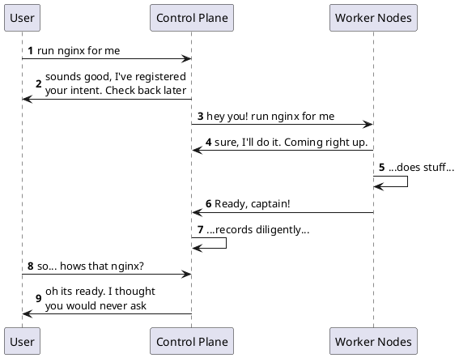

# Kubernetes Overview (Brain Dump)

If you are arriving here and you don't know....

* what kubernetes is... [read this](https://kubernetes.io/docs/concepts/overview/)
* what the k8s control plane is... [read this](https://kubernetes.io/docs/concepts/overview/components/)

We'll unpack these concepts in much more detail as we go on, but we need to establish some baseline of knowledge, and no need to recreate the wheel here.

## The Beginning


When people refer to a "kubernetes cluster" they tend to be referring to the capability of running a container workload in the cloud. That speaks to an outcome and not really the "well, what is it?" question -- and at its core a k8s cluster is the union of two distinct logical parts: a control plane responsible for managing the system, and a fleet (as small as 1) of "worker" nodes that can actually run container* workloads. (TODO: why "container" is in quotes -- reference various runtimes)

In "managed kubernetes environments" -- e.g. AWS Elastic Kubernetes Service (EKS), Google's GKE (Google Kubernentes Engine), Azure's AKS (Azure Kubernetes Service) -- the cloud provider tends to run the contorl plane on a user's behalf, and its completely hidden away as an implementation detail. One of the major purposes of this project is to dive head-on into the control plane, so we won't be waving any hands here.

Essentially the cloud provider agrees to operate the control plane and the customer uses the cloud provider's other services -- compute, storage, load balancers, container registries -- to power the fleet of worker nodes (and of course, make money off the use of those resources). We won't get too much into the financials but you can see why some cloud providers don't even charge for their "managed k8s" service -- while they expend some resource behind the scenes on the machinery that makes up the control plane, they anticipate users will spend money on the resources needed to actually make up the "worker" plane since it is these workers that actually _run_ user applicaitons (aka workloads).

Now, in reality different providers have different commercial setups. Some charge for the control plane, others make it available for free but charge to make it "highly available", or charge for other features like logging... there is a spectrum. But the general idea is this: the cloud provider provides the control plane "as a service" (i.e. out of your direct, full control) and the user pays for a worker node fleet... and the two combine to create a "cluster".

## So what is the control plane?

Well, thats a tough question. At the end of the day its the "command and control" infrastructure needed to actually run container workloads... It gets told to run container workloads or open ports on containers or fetch logs, passes those commands on to other folk who do the hard work, and then handles the answer.

...But that doesn't really help clarify things at all.

Often times control plane explanations begin with a discussion of control loops... we'll be lazy and do the same.

<blockquote>
In robotics and automation, a control loop is a non-terminating loop that regulates the state of a system.

Here is one example of a control loop: a thermostat in a room.

When you set the temperature, that's telling the thermostat about your desired state. The actual room temperature is the current state. The thermostat acts to bring the current state closer to the desired state, by turning equipment on or off.

In Kubernetes, controllers are control loops that watch the state of your cluster, then make or request changes where needed. Each controller tries to move the current cluster state closer to the desired state.

[Source](https://kubernetes.io/docs/concepts/architecture/controller/)
</blockquote>

Which is a pretty good mental model to start with but kind of lacks the _oomph_ we need to really understand what the contol plane does.

Let's start with a small slice of the pie -- tracing through what happens when we kubernetes to run a "container" (pod) -- as an entrypoint to understanding the responsibilities of the control plane and how it works.

### Launching a pod: Level 0: The surface of the onion

If you don't know what a pod is... read the [k8s pod intro](https://kubernetes.io/docs/concepts/workloads/pods/)

We'll go through this piece by piece, starting with a gross oversimplication and then slowly unpacking layers like an onion until we have a better sketch of what the control plane does.

So: I want to run an HTTP server serving a basic static website with the most bare-bones of "Hello World" index html file. Nginx is fine, so lets have it be nginx.



Alright, so that seems logical enough. Lets unpack it a bit.

**The User** in this basic example is someone invoking an RPC (remote command invocation) call against an API server being run as part of the control plane. How that RPC call might take several manifestations but at its most basic it can be an HTTP request where the body contains the intent to run nginx. It might look like the below:

```yaml
apiVersion: apps/v1
kind: Deployment
metadata:
  name: nginx
  labels:
    app: nginx
spec:
  replicas: 1
  selector:
    matchLabels:
      app: nginx
  template:
    metadata:
      labels:
        app: nginx
    spec:
      containers:
      - name: nginx
        image: nginx:1.14.2
        ports:
        - containerPort: 80
```

And it really is that simple. If I were to run `kubectl apply -f - <<<"CONTENTES FROM ABOVE"`, `kubectl` simply takes my user input, validates it, looks up the details of the API server like its host and port, looks up some credentials, and then packages the YAML up into a pretty little HTTP request and sends it along to the remote server (perhaps with a sprinking of credentials). The "control plane API server" validates the permissions of the user making the HTTP request, validates the payload matches the expected schema for a "create deployment" request, and, if all looks good, continues on in the sequence as we drew it above.

I mean the emperor wears no clothes here, see for yourself if we jack up the `kubectl` [logging verbosity](https://kubernetes.io/docs/reference/kubectl/cheatsheet/#kubectl-output-verbosity-and-debugging):

```bash
❯ kubectl apply --v=8 -f output/nginx.deployment.yaml
I0929 15:15:17.887777   37013 loader.go:374] Config loaded from file:  /Users/jroberts/repos/personal/k8s-the-harder-way/output/kube-configs/admin.kubeconfig
I0929 15:15:17.888660   37013 round_trippers.go:463] GET https://127.0.0.1:6443/openapi/v2?timeout=32s
I0929 15:15:17.888668   37013 round_trippers.go:469] Request Headers:
I0929 15:15:17.888673   37013 round_trippers.go:473]     User-Agent: kubectl/v1.25.0 (darwin/arm64) kubernetes/a866cbe
I0929 15:15:17.888676   37013 round_trippers.go:473]     Accept: application/com.github.proto-openapi.spec.v2@v1.0+protobuf
I0929 15:15:17.903929   37013 round_trippers.go:574] Response Status: 200 OK in 15 milliseconds
I0929 15:15:17.903944   37013 round_trippers.go:577] Response Headers:
I0929 15:15:17.903948   37013 round_trippers.go:580]     Date: Thu, 29 Sep 2022 22:15:17 GMT
I0929 15:15:17.903951   37013 round_trippers.go:580]     Etag: "9DB40C853CA3ADDD649055A9853FE28D1264FAEE1DBFA41212431A2A7B89BAC87C7E2059BAEC006DA5856A114731A4658CCA9BFFCB82FEB3B45304C9D8237EBB"
I0929 15:15:17.903955   37013 round_trippers.go:580]     X-Kubernetes-Pf-Prioritylevel-Uid: 5dfa948e-cd85-4716-9e5e-60b0081f1d1e
[...TRUNCATED...]
I0929 15:15:17.990891   37013 round_trippers.go:463] POST https://127.0.0.1:6443/apis/apps/v1/namespaces/default/deployments?fieldManager=kubectl-client-side-apply&fieldValidation=Strict
I0929 15:15:17.990897   37013 round_trippers.go:469] Request Headers:
I0929 15:15:17.990901   37013 round_trippers.go:473]     Accept: application/json
I0929 15:15:17.990904   37013 round_trippers.go:473]     Content-Type: application/json
I0929 15:15:17.990908   37013 round_trippers.go:473]     User-Agent: kubectl/v1.25.0 (darwin/arm64) kubernetes/a866cbe
I0929 15:15:18.004996   37013 round_trippers.go:574] Response Status: 201 Created in 14 milliseconds
I0929 15:15:18.005028   37013 round_trippers.go:577] Response Headers:
I0929 15:15:18.005039   37013 round_trippers.go:580]     Cache-Control: no-cache, private
I0929 15:15:18.005048   37013 round_trippers.go:580]     Content-Type: application/json
I0929 15:15:18.005058   37013 round_trippers.go:580]     X-Kubernetes-Pf-Flowschema-Uid: 83eb73fc-81b4-435a-b45a-8d28a44a3f08
I0929 15:15:18.005067   37013 round_trippers.go:580]     X-Kubernetes-Pf-Prioritylevel-Uid: 5dfa948e-cd85-4716-9e5e-60b0081f1d1e
I0929 15:15:18.005075   37013 round_trippers.go:580]     Content-Length: 2392
I0929 15:15:18.005084   37013 round_trippers.go:580]     Date: Thu, 29 Sep 2022 22:15:18 GMT
I0929 15:15:18.005145   37013 request.go:1073] Response Body: {"kind":"Deployment","apiVersion":"apps/v1","metadata":{"name":"nginx","namespace":"default","uid":"4599327e-a8fc-4eb0-9dfd-ac4be1ef3f0d","resourceVersion":"3173","generation":1,"creationTimestamp":"2022-09-29T22:15:17Z","labels":{"app":"nginx"},"annotations":{"kubectl.kubernetes.io/last-applied-configuration":"{\"apiVersion\":\"apps/v1\",\"kind\":\"Deployment\",\"metadata\":{\"annotations\":{},\"labels\":{\"app\":\"nginx\"},\"name\":\"nginx\",\"namespace\":\"default\"},\"spec\":{\"replicas\":1,\"selector\":{\"matchLabels\":{\"app\":\"nginx\"}},\"template\":{\"metadata\":{\"labels\":{\"app\":\"nginx\"}},\"spec\":{\"containers\":[{\"image\":\"nginx:1.14.2\",\"name\":\"nginx\",\"ports\":[{\"containerPort\":80}]}]}}}}\n"},"managedFields":[{"manager":"kubectl-client-side-apply","operation":"Update","apiVersion":"apps/v1","time":"2022-09-29T22:15:17Z","fieldsType":"FieldsV1","fieldsV1":{"f:metadata":{"f:annotations":{".":{},"f:kubectl.kubernetes.io/last-applied-configuration":{}},"f:labels":{".":{},"f:app":{}}},"f [truncated 1368 chars]
deployment.apps/nginx created
I0929 15:15:18.005711   37013 apply.go:466] Running apply post-processor function`
```

Sure there was a little back and forth in the beginning related to validation (`kubectl` by default actually tries to apply client-side validation by first looking up the OpenAPI scheme associated with the API server it going to send the request to eventually, which can be turned off with the `--validate='ignore'`). But do you see the line `POST https://127.0.0.1:6443/apis/apps/v1/namespaces/default/deployments?fieldManager=kubectl-client-side-apply&fieldValidation=Strict`? Pretty much did what I told you -- kubectl took our input, validated it, wrapped it in an HTTP request, and then sent that along to the control plane API server who created a `deployment.apps/nginx` for us (whatever that is).

(Note, the above is actually still technically a lie, but its a white lie simplification... if we set `--server-side=true` it would be pretty close to true though).

_TODO: Add a page on kubectl and client-side application and validation_

### Launching a pod: Level 1: Unpacking the components on the control plane

So pretty conveniently in the above sequence diagram we just draw a box for the "control plane" actor up at the top. But the control plane isn't just this API server thing we alluded to in the prior section. Its actually a few different components all working together that create the apparition we call the "control plane". Let's dive into it.

#### Overview

#### etcd

#### kube-apiserver

#### kube-scheduler

#### kube-controller-manager


### Launching a pod: Level 2: A detour to talk about authentication and networking
